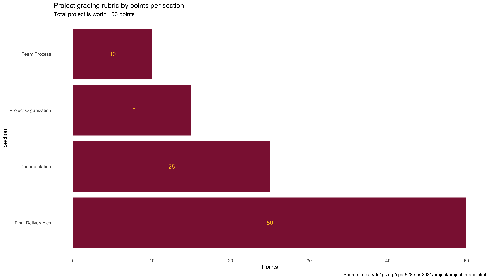
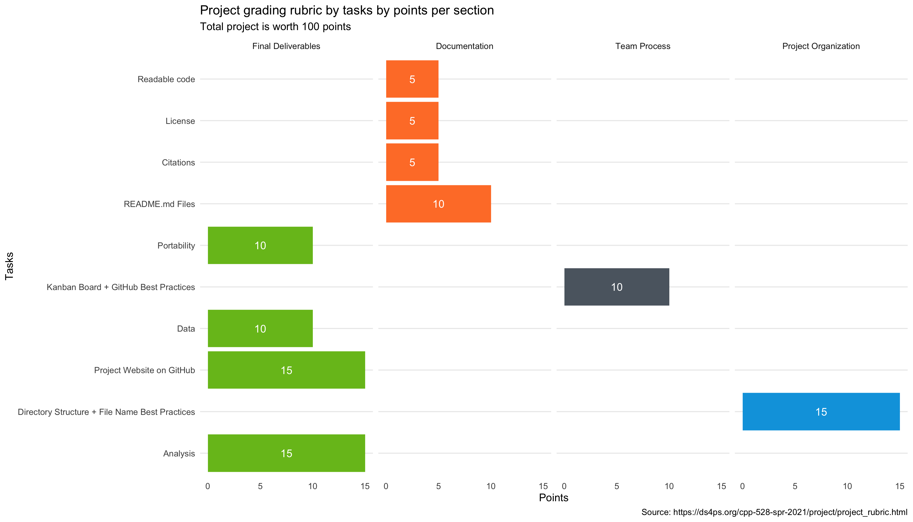

# CPP 528 – Group Project Instructions

## Overview

The project for this course is designed as an opportunity to practice project management skills by showing your research on a static website hosted on GitHub Pages. Overall, this project is worth 100 points and makes up the bulk of your final grade.

{width="150%"}

It is broken into six steps, leaving one week at the end of the semester for a final round of revisions, documenting the process, and house-cleaning in your GitHub repo.

* Week 01: Introduction to project management
* Week 02: Introduction to data management
* Week 03: Descriptive analysis of neighborhood change
* Week 04: Predicting median home value change, 2000 to 2010
* Week 05: Adding federal program data to your predictive models
* Week 06: Test reproducible work flow with a parameter change
* Week 07: Finalize project website and project requirements

Each week you will work on one step of the analysis as a lab. These labs should be completed and submitted individually (you are still allowed to collaborate on labs but submit your labs individually). 

As a team, you'll collaborate to synthesize the work from each other into one concrete project. Together, you will primarily focus on the integration of content into a static website which makes all of the steps in your research transparent and easily reproducible.


## Table of Contents
You can think about the final deliverable as sections in a report. The table of contents will be as follows: 

1. Executive Summary (4-6 sentences)
    + Overview / Research Question Program Details
    + Data
    + Methods
    + Results

2. Part I: Neighborhood Change
    + Metrics
        + Data sources
        + Median Home Value
        + Gentrification
    + Descriptive Analysis of Neighborhood Change
        + Average change in MHV from 2000 to 2010
    + Predicting Change Based on 2000 Neighborhood characteristics
        + Neighborhood demographics
        + Spatial characteristics (population density, adjacent tracts)
3. Part II: Evaluation of Tax Credits
    + Overview of Programs
        + New Market Tax Credits
        + Low Income Housing Tax Credits
    + Data sources
    + Descriptive Statistics
        + Dollars given out
        + Characteristics of neighborhoods that received them
        + Characteristics of those that did not
    + Predictive Analysis
        + Aggregate credits given between 2000 and 2010
        + Update models by adding tax credit amounts
4. Part III – Results and Conclusion

Note that there are some sections like “Overview of Programs” that require a succinct narrative for context. But most of the sections will focus on describing the methodology to the audience and walking them through the process of generating results. These chapters will have more of a tutorial or code- through feel than a final report tone. The goal of those sections is to make the methodology as transparent as possible and to make it easy for others to reproduce the work and extend it.

# Grading Rubric

{width="150%"}

Your grade will largely be based upon your demonstration of mastery of project management principles and your ability to implement the project steps.

Your deliverable will be a report packaged as a static website hosted on GitHub Pages (just like this course website), and all of the components necessary to replicate results (data, code, documentation of packages, etc).

You will be allocated points based upon your performance on the following criteria:


## FINAL DELIVERABLES [50 points]

### Project Website hosted on GitHub Pages [15 points]

You will create an `index.md` file to serve as the landing page for the report, and link to report chapters from that document. Individual chapters should be stored as separate `RMD` files (rendered as `HTML` files for the report). You can link to rendered `HTML` files by referencing them in the proper sub-directories:

* http://site-url.com (will load the index file)
* http://site-url/analysis/file-name.html (file in `analysis/` sub-directory)
* Website is active and live
    + All links work properly
* GitHub pages template is clean and effective
    + Custom CSS used for consistent report style
* Landing page includes:
    + a table of contents
    + a link to files on the GitHub repo with description of content
    + replication instructions (software needed, how to access files, etc) 
    + [license info](https://docs.github.com/en/github/creating-cloning-and-archiving-repositories/licensing-a-repository)
* About Us page 

### Data [10 points]

* Original data sources are documented and raw data used in the project has been archived
* Data steps clearly walk through the process of creating new variables, cleaning data, and joining tables.
    + These steps should exist in a standalone `.R` script that hosts all of these steps and produces `.rds` files that store data used throughout your project. 
    + This allows you to avoid copying and pasting the same cleaning code while holding one file as the source of truth for your data cleaning
* `README.md` in the data folder that explains the organization of the files

### Analysis [15 points]
* Quality of models and presentation of the steps to produce results: 
    + Chapter on descriptive analysis of neighborhood change
    + Chapter predicting change with neighborhood characteristics
    + Chapter describing tax credit programs (NMTC & LIHTC)
    + Predictive models after adding tax credit programs
* Data manifest:
    + A table that reports the initial sample size in the raw data set, the sample size in the final model, and explain where and why each observation was dropped 
* All results are easily reproducible
    + Packages and versions reported courtesy of the [`renv`](https://rstudio.github.io/renv/articles/renv.html) package.
    + Clear description of which data is used for each model
        + Appropriate references to detailed data step files when helpful
    + Functions and arguments are explained when they are not clear
        + Specialized packages or functions
        + Custom functions

### Portability [10 points]

* Can anyone run project code on their computer without having to change working directories or other settings?
* Note that Windows and Mac use different styles for paths (forward vs backwards slash) so functions like [`here::here()`](https://here.r-lib.org/) can help avoid those issues.
* Report the R environment and package versions used to create the analysis
    + Usage of `renv` package satisifes this requirement

## TEAM PROCESS [10 points]

* Utilization of Kanban Boards
    + When used correctly, a manager should never have to ask for a progress report. The Kanban board should show exactly what people are working on at the current moment, and progress thus far on the project.
    + Project broken into appropriate-sized steps (cards)
    + Steps broken into task lists
    + Each card is assigned to at least one team member
    + Card status is updated weekly

* GitHub Commits
    + Commits have useful names and clear descriptions 
        + Good example: `'Create .rds file that stores original and final predictive model'`
        + Bad example: `'Updated files'`
        + In general, good commits start with a present tense verb that summarizes your work in 50 character or less. If I can't tell exactly what change/edit was made, neither will you six months from now.
* Code Review
    + Each member has managed the code review process at least twice, once as a reviewer and once as someone asking for a review.
* `.gitignore` files and Secret Passwords
    + Add file names and file types to the `.gitignore` file to prevent them from syncing to the team repository
        + Use the [R specific `.gitignore` file](https://github.com/github/gitignore/blob/master/R.gitignore) courtesy of GitHub
    + Never store passwords on GitHub. If you don't know if you are about to send confidential information - or if you have - reach out immediately.
        + Place passwords (or API keys) as character vectors (i.e. `my_api_key = 'abc123'` into a file called `password.R`. When you need that password in your `.r` or `.rmd` file, obtain safely by calling `source(here::here("password.R")`.
        + Add the file `password.R` to your `.gitignore`. That means you can all keep separate passwords in a file with the same name on your own computers, and the code will run fine on each person’s machine.
        
## PROJECT ORGANIZATION [15 points]
The ideal directory structure makes it possible for a random stranger to find files easily, even if they have never seen your project before. The “stranger” is most likely you six months from now when you are trying to find code that you want to re-use or update your project and you have no recollection which files are the final working versions and which of the 100 datasets you created are used in the final program.

### Uniform directory structure

Every team's directory structure should look like this:

```bash
. (root/main/project directory, such as /Users/pacman/asu/cpp-528-spr-2021)
├── README.md
├── analysis
│   └── README.md
├── assets
│   ├── README.md
│   ├── css
│   │   └── README.md
│   └── images
│       └── README.md
├── <RStudio Project Label>.Rproj
├── data
│   ├── README.md
│   ├── raw
│   │   ├── LTDB-DATA-DICTIONARY.xlsx
│   │   ├── LTDB-codebook.pdf
│   │   ├── LTDB_County_1980_Global_Neighborhood.csv
│   │   ├── LTDB_County_1990_Global_Neighborhood.csv
│   │   ├── LTDB_County_2000_Global_Neighborhood.csv
│   │   ├── LTDB_County_2010_Global_Neighborhood.csv
│   │   ├── LTDB_Std_1970_fullcount.csv
│   │   ├── LTDB_Std_1980_fullcount.csv
│   │   ├── LTDB_Std_1990_fullcount.csv
│   │   ├── LTDB_Std_2000_fullcount.csv
│   │   ├── LTDB_Std_2010_fullcount.csv
│   │   ├── LTDB_Std_All_Sample.zip
│   │   ├── LTDB_Std_All_fullcount.zip
│   │   ├── README.md
│   │   ├── cbsa-crosswalk.rds
│   │   ├── ltdb_data_dictionary.csv
│   │   ├── ltdb_std_1970_sample.csv
│   │   ├── ltdb_std_1980_sample.csv
│   │   ├── ltdb_std_1990_sample.csv
│   │   ├── ltdb_std_2000_sample.csv
│   │   └── ltdb_std_2010_sample.csv
│   ├── rodeo
│   │   ├── LTDB-1970.rds
│   │   ├── LTDB-1980.rds
│   │   ├── LTDB-1990.rds
│   │   ├── LTDB-2000.rds
│   │   ├── LTDB-2010.rds
│   │   ├── LTDB-META-DATA.rds
│   │   └── README.md
│   └── wrangling
│       └── README.md
├── labs
│   ├── wk01
│       └── README.md
│   ├── wk02
│       └── README.md
│   ├── wk03
│       └── README.md
│   ├── wk04
│       └── README.md
│   ├── wk05
│       └── README.md
│   ├── wk06
│       └── README.md
│   └── wk07
│       └── README.md
```

When creating files/folders, here are some helpful guidelines:

* Never capitalize unless necessary or helpful for emphasis
* Use an underscore (`_`) instead of a space in file and folder names since spaces can cause a lot of problems in paths and are usually replaced with arbitrary characters.
* Try to have short but meaningful file names that are memorable
* Add a `README.md` file inside of each folder with, at minimum, a one-sentence description of the directory.
* If files need to run in a specific order, or they represent things like chapters of a book, consider naming them something like step_01, step_02, etc.
* File names:
    + Consistent naming throughout project, including rules for capitalization and dates
    + When order matters (for example steps in analysis or chapters of a report) the file order matches order in which they should be run
    + Effective use of leading zeros to maintain proper file order (09, 10, 11, ... )
* Clear system to keep track of the current version and archive revisions

It is helpful to have only the current version of a file in the project directory, and move all old versions to an `old-files/` or `archive/` folder if you need to reference them. If you have multiple versions of the same file in your project folder there is a high probability that one team member accidentally uses the wrong version (especially if they have not synced their project directory). It also prevents you from reading old versions of the file into a script.

## DOCUMENTATION [25 points]

### README Files [10 points]

Main `README.md` in the repository

* Overview of the project and the code
* Links to appropriate pages in the report
* Be kind and include convenient code to install all packages you use in the report
    + Since you're using `renv` package, you should have a `renv.lock` file that stores your packages and their dependencies. Therefore, just make sure you explictly state that the reader has to use `renv::restore()` to download the specific versions of the packages used in your project.
    + Only one line of code but it is powerful!
* If you write a custom package, include the command to install the package from GitHub so it can be easily copied and pasted
* Contact information for people that will be maintaining the project. At most, ASU emails; at minimum, links to your personal GitHub pages.
* If you include a shiny app, include the launch from GitHub command in the README file so that it is accessible
* Sub-folder README files
    + Should explain the purpose and organization of the directory
    + Include instructions for using the files in the folder

### Readable Code [5 points]

* Everyone follows the same code style
    + Clean and consistent feel
    + Indents used to group code appropriately
* Objects follow consistent naming conventions
    + Data sets are nouns, functions are verbs
* Code is commented appropriately throughout the files

### Citations [5 points]

* All sources are appropriately cited
* Bibtex citation database is created for the project
* R Markdown generates a bibliography automatically
    + Include a citation list at the end of each chapter License [5 points]
* Select an appropriate open-source license for the project and include it in the repository.
* Add a `LICENSE` file on GitHub and include the appropriate licensing info

### Citation Integration in RMD

Here is an example [`.rmd` file](https://github.com/cenuno/analytic_project/blob/master/R/analysis/02_report.rmd) that does two things:

1. It imports a [`.bib` file](https://github.com/cenuno/analytic_project/blob/master/R/analysis/bibliography.bib) inside the YAML header (see [line 6](https://github.com/cenuno/analytic_project/blob/master/R/analysis/02_report.rmd#L6)); and
2. It prints out all the citations at the end of the `.rmd` file (see [line 35](https://github.com/cenuno/analytic_project/blob/master/R/analysis/02_report.rmd#L35)).

For context, checkout [RStudio's resource guide](https://rmarkdown.rstudio.com/authoring_bibliographies_and_citations.html#Bibliographies).

